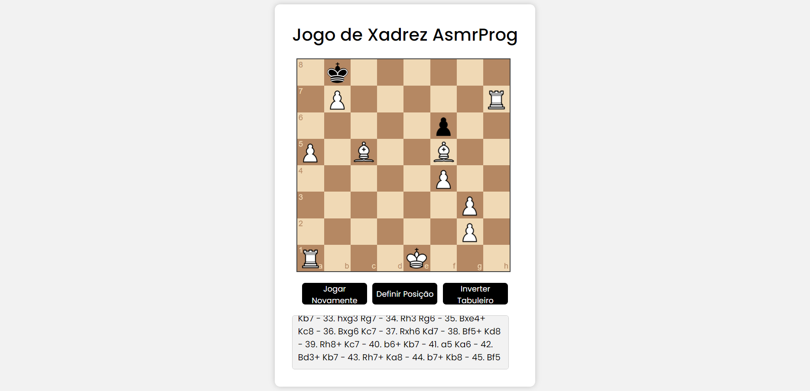

###Jogo de Xadrez (Contra o Computador)

Neste tutorial ([Open in Youtube](https://youtu.be/XaFYLIEq4E8)), vou mostrar como programar um jogo de xadrez com JavaScript. Neste jogo de xadrez em JavaScript, você pode jogar contra o computador, inverter o tabuleiro e definir a posição. Neste código, você aprenderá a usar as bibliotecas chessboardjs e chess.js 

Notação FEN
**A Notação FEN (Forsyth-Edwards) é uma notação padrão usada para representar uma posição específica no tabuleiro de xadrez. Ela fornece uma maneira concisa e legível por humanos de descrever a disposição das peças no tabuleiro, bem como outras informações importantes sobre a posição. Veja como a notação FEN funciona:

Uma string FEN consiste em seis campos separados por espaços:

Posicionamento das Peças (8 fileiras): Este campo representa as posições das peças no tabuleiro. Cada fileira é representada por uma série de caracteres, onde:

K representa um rei branco.
Q representa uma rainha branca.
R representa uma torre branca.
B representa um bispo branco.
N representa um cavaleiro branco.
P representa um peão branco.
k representa um rei preto.
q representa uma rainha preta.
r representa uma torre preta.
b representa um bispo preto.
n representa um cavaleiro preto.
p representa um peão preto.
Dígitos (1-8) representam casas vazias, sendo o número indicativo da quantidade de casas vazias consecutivas.
Por exemplo, rnbqkbnr/pppppppp/8/8/8/8/PPPPPPPP/RNBQKBNR representa a posição inicial de um jogo de xadrez.

**Cor Ativa (1 caractere): Este campo indica de qual jogador é a vez de jogar. w representa a vez das Brancas, e b representa a vez das Pretas.

**Disponibilidade de Roque (1-4 caracteres): Este campo indica se o roque ainda está disponível para cada jogador. Os caracteres usados são:

K para o roque kingside das Brancas.
Q para o roque queenside das Brancas.
k para o roque kingside das Pretas.
q para o roque queenside das Pretas.
- se nenhum roque for possível.

**Alvo de Captura "En Passant" (1-2 caracteres): Se um peão acabou de se mover duas casas para frente a partir de sua posição inicial, este campo representa a casa onde o peão oponente pode capturar "en passant". Caso contrário, é representado como -.

**Relógio de Meio-Jogo (1-2 caracteres): Este campo representa o número de meio-movimentos (ply) desde o último movimento de peão ou captura. É usado para a regra dos cinquenta movimentos.

**Número Total de Movimentos (1-2 caracteres): Este campo representa o número total de movimentos completos (turnos) no jogo. Começa em 1 e é incrementado após o movimento das Pretas.

Aqui está um exemplo de string FEN:

bash
Copy code
rnbqkb1r/ppp1pppp/5n2/3p4/3P4/8/PPP2PPP/RNBQKBNR w KQkq - 0 4
Este FEN representa uma posição específica onde é a vez das Brancas jogarem, ambos os lados têm potencial para fazer roque do lado do rei e da rainha, não há alvo "en passant", o relógio de meio-jogo é 0, e o número total de movimentos é 4.

Você pode usar a notação FEN para registrar e compartilhar posições específicas de xadrez e usá-las para diversos fins, incluindo configurar posições personalizadas para análise ou prática.

Captura de Tela
Aqui temos a captura de tela do projeto:

